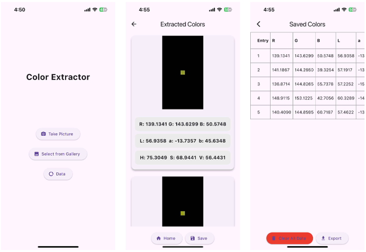

# Color Extractor App

This app extracts the average color channel values from three color spaces—RGB, Lab, and HSV—and stores the extracted data in a tabular format, which can be exported as an Excel file. It was developed using the Flutter framework.

Main functions include:
- Image acquisition with segmentation mask
- Image processing
- Extracting color values
- Saving and exporting the data

The app features three main screens: (1) Home screen, (2) Extraction results screen, and (3) Data visualization.

Part of the thesis entitled: "Development of a Non-invasive Vision-based Halochromic Sensor System for Chronic Wound Monitoring"
